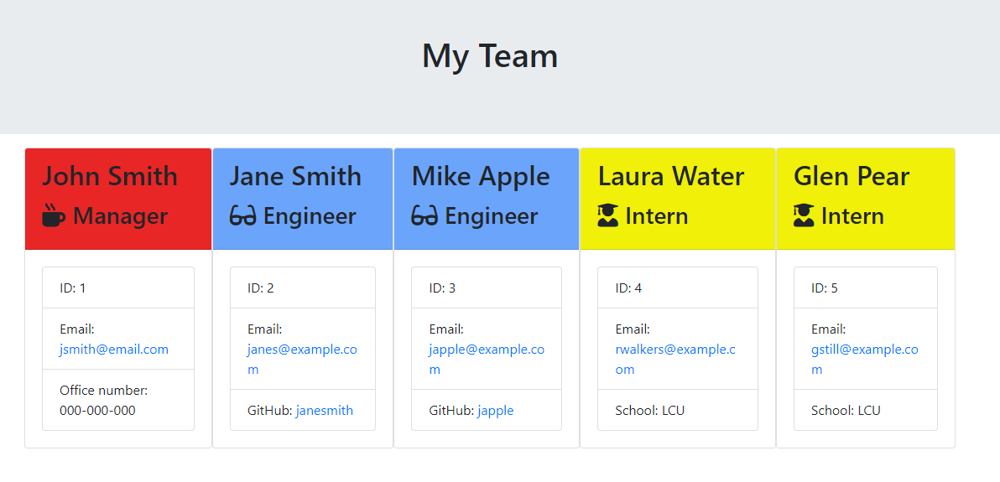

# Team Profile Generator

## Description

A Node.js command-line application built to take in information about the manager and employees, which then is used to generate a HTML file with cards of said employees. This app also contains tests from Jest, which were used to pass constructor tests.

## User Story

As a manager a user want to generate a webpage that displays my team's basic info so that a user have quick access to their emails and GitHub profiles.

## Instructions

Install the app by cloning the repo and its dependencies, then start by typing in "node index.js" into the terminal. If you made a mistake, then re-run the app, it will overwrite the HTML file, so there is no need to delete it manually each time.

HTML file will be saved in the same directory as index.js file.

## Demo Screenshot and Video

Screenshot of the HTML after creating a template team. Video demo link just below it.

https://watch.screencastify.com/v/pyXCIwCG7YXAbu9iZGBh

## Links

Repository: https://github.com/MrMaciejM/team-profile-generator

Published site: there is no published site because this is a terminal app.

## License

MIT License

Copyright (c) 2023 Maciej

Permission is hereby granted, free of charge, to any person obtaining a copy
of this software and associated documentation files (the "Software"), to deal
in the Software without restriction, including without limitation the rights
to use, copy, modify, merge, publish, distribute, sublicense, and/or sell
copies of the Software, and to permit persons to whom the Software is
furnished to do so, subject to the following conditions:

The above copyright notice and this permission notice shall be included in all
copies or substantial portions of the Software.

THE SOFTWARE IS PROVIDED "AS IS", WITHOUT WARRANTY OF ANY KIND, EXPRESS OR
IMPLIED, INCLUDING BUT NOT LIMITED TO THE WARRANTIES OF MERCHANTABILITY,
FITNESS FOR A PARTICULAR PURPOSE AND NONINFRINGEMENT. IN NO EVENT SHALL THE
AUTHORS OR COPYRIGHT HOLDERS BE LIABLE FOR ANY CLAIM, DAMAGES OR OTHER
LIABILITY, WHETHER IN AN ACTION OF CONTRACT, TORT OR OTHERWISE, ARISING FROM,
OUT OF OR IN CONNECTION WITH THE SOFTWARE OR THE USE OR OTHER DEALINGS IN THE
SOFTWARE.
